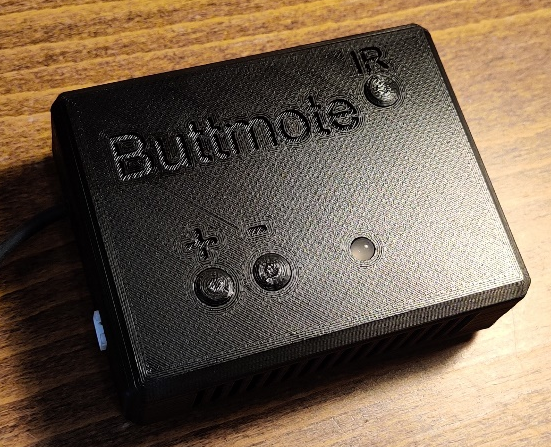
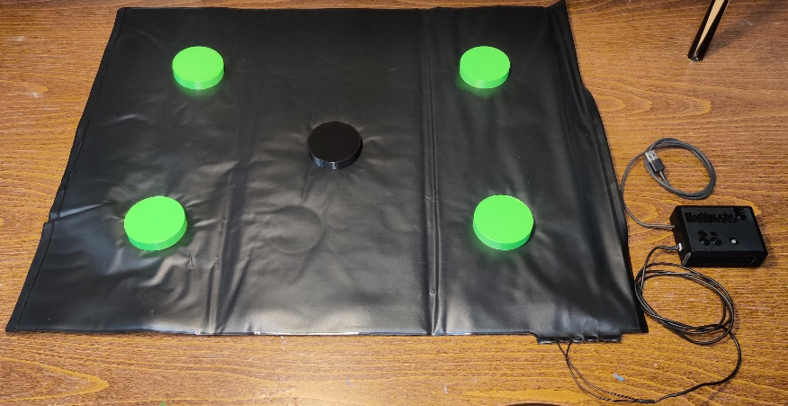
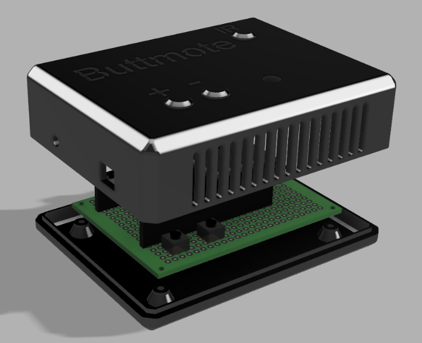
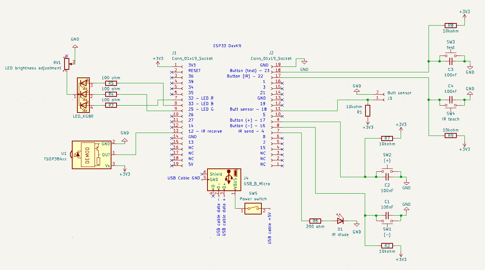

# Buttmote

The aim of our project was to create a remote controller that will detect when a person sits or gets up on a sofa, turn on and off TV with an IR signal and control smart lights with user defined settings through WiFi using UDP packets containing a JSON message.

## Table of Contents

1. [How it works]()

2. [Technologies]()

3. [Implementation]()
    3.1 [Wi-Fi & UDP]()

    3.2 [Web Server]()

    3.3 [freeRTOS Tasks]()

    3.4 [Enclosure]()

    3.5 [Electrical design]()

4. [Challenges]()
    4.1 [Amazon Alexa]()

    4.2 [IR sender]()

    4.3 [Pressure sensor]()

5. [Results]()

6. [Credits]()

## How it works

The device is a made from 2 parts. A casing that works as brains and pressure mat designed to go under sofa cushion.

The device has these functionalities:

* Pressure mat: Detects when person has sat down on sofa
* IR reciever & sender: You can teach IR signals from your remote to be stored in device. This way the device can open up TV and for example your favorite channel when you sit down.
* Light controls: The device controls smart lights with 3 states that user can modify easily bith buttons.
* LED: Indicator for user to see if device is functioning propeply

Device has 3 phases:

* Standing
* Sitting
* Standup

### Standing

This is the normal mode. Lights are on, tv is off. (NOTE: user can modify light states and brightness on each phase. For clarity in this document Standing = full brightness, Sitting = lights off, Standup = dimmed lights)

### Sitting

When person sits down the pressure sensor is triggered and device goes into sitting mode. Here TV is turned on, lights are turned off and if person has favorite TV channel, TV is turned to that channel.

### Standup

This is the middle phase where there has been person sitting and then person stands up. We understand that people might want to go get snacks/drinks so it would be anyoying for TV to turn off and lights on. That is why we have customizable Standup phase where in user set time (for example 15 mins) the device will not turn TV off and it will turn on the lights with a dimm brightness, so that person can see to walk but doesent get blasted with light.

## Technologies and Materials

### Technologies

In this project we used the following technologies:

* KiCad: Electrical design
* Fusion 360: 3D modeling
* Creality K1 3D printer
* ESP32 Dev Board
* IR Receiver & Emitter
* Pressure Sensor
* Smart Light
* RGB LED
* Buttons for UI
* FreeRTOS
* WiFi & UDP
* SPIFFS: Saving the IR codes

## Implementation

### Wi-Fi & UDP

The device uses Wi-Fi connectivity and UDP for communication with smart lights on the network. Communication between the device and the smart lights is structured in JSON format. The communication happens so that the device initiates communication with smart lights and the lights only work as a listening device and don’t send any messages to the device.

The JSON format allows for easy modifying of messages, providing a flexible way for integrating various commands and   parameters. These messages can include commands to control light brightness, color, and other parameters used by the smart lights. Any new smart lights that are added can be easily controlled because every light has a unique ID starting from 1. So, to control many lights at the same time you just send the same JSON message and increase the ID number between messages.

### Web Server

The web server starts by initializing the SPIFFS file system in order to fetch the required files to be sent to the client, after which a Wi-Fi connection with the set credentials is made. These initialization steps are also required by other parts of the Buttmote codebase. The web server then begins the process of starting the proper server itself by creating a static AsyncWebServer instance on port 80, which is the default HTTP port. It creates a route to handle the root page of the website, which is the site that loads when the IP address is visited directly. It uses this route to serve the index.html file while also leaving room for future implementations of the access point and captive portal. Routes for the style.css and main.js files are also created in a similar fashion, however these routes are just fully serving   static files as there is no need to expand their implementation.

We then define routes for the API as these require special handling of JSON and related variables. These routes are quite dynamic and thus they have their own handler functions. The handler for the /api/status path first creates a DynamicJsonDocument instance and a character buffer to store the data to be sent, each of these use roughly a kibibyte of memory. It then populates the JSON document with data containing the current state of the Buttmote and serializes it to a string to be sent to the client. It sends the JSON string with a status code of 200 indicating that the request was successful. The handler for the /api/settings path takes in the JSON document sent by the client by using a special AsyncCallbackJsonWebHandler. It then checks for the presence of the 17required settings and checks that they are of the correct type. If all these checks are successful it updates the settings and responds with status code 200 indicating that the request was successful.

#### Client Side Web UI

On the client side after the main page is loaded it periodically polls the /api/status path with GET requests every second and updates the UI to match accordingly based on the received JSON data. It displays whether or not a person is currently sitting on the Buttmote and also has a display for which state the light should currently be experiencing, the light however does not react to the real brightness of the bulb and would have been fixed if we had more time as adjusting the individual brightness of each state was added very late into development. This is also the reason that the brightnesses of the states cannot be updated from the Web UI. The Web UI however does allow the user to update the idle time to change between states and to enable or disable the IR functionality. It achieves this bysending a POST request to the /api/settings path containing the formatted JSON data.If it receivesand error it alerts the user about what went wrong and continues operation as normal.

### FreeRTOS Tasks

#### Lights & UDP
The synchronization between tasks is achieved with the use of binary semaphores. Before a task initiates its execution, it waits for the corresponding semaphore to be given. Each light mode task modifies the JSON message to its specific functionality by changing the needed parameters in the message. The device lets the user save settings to different light states that are: Sitting down, initial stand up, standing up. These are saved in preferences which allows the device to remember user saved settings even when losing power. Messages are made using these saved values. Once the message is ready, the current light task gives a binary semaphore to the UDP task and now the UDP task knows that it can transmit the message to the smart lights.

#### IR

The IR send task waits for a binary semaphore from the
sitting logic task. When the semaphore is received, the task 
sends the stored IR signal to turn the TV on or off and starts 
waiting for another semaphore.

The IR receive task waits for a binary semaphore from IR
receive button task. When the semaphore is received, the IR 
receiver is activated, Wi-Fi is disabled and the task starts 
waiting for a signal to the IR receiver. Wi-Fi needs to be 
disabled during receiving to avoid interference from Wi-Fi 
communication. When a signal is received, it is stored to a 
structure for the IR send task and to preferences to be saved 
when the device is powered off. After the signal is saved, the 
IR receiver is stopped, Wi-Fi is activated and the task returns to waiting for another semaphore.

IR receive button task polls the IR receive button 10 times per second. When the button is pressed, the task gives abinary semaphore to IR receive task to signal it to start receiving.

#### LED

The ControlLedsTask continuously checks the device’s state. It starts by turning on the green LED, indicating 12 the device is powered on. If teaching mode is signaled, the blue LED lights up. Otherwise, it checks for the WiFi connection, a successful connection triggers the white LED, while a failed connection triggers the red LED.

#### SittingLogic

The sittingLogictask checks the state of the pressuresensor. If the sensor detects sitting, and the timer is not yet triggered, the task sends a binary semaphore to turn off the lights, and another semaphore to send the IR signal that turns on the TV. When standing is detected, a timer starts, if the timer elapses, the task sends a binary semaphore to turn on the lights, and another to send the IR signal to turn off the TV.

### Enclosure

The enclosure is a two part design and it is held together with four hidden M2 allen screws that thread into brass inserts. The screws also hold the circuit board in place as it is sandwiched between the two halves of the enclosure. The buttons use a compliant mechanism to improve the feel and to prevent accidental presses, as the tactile switches on the circuit board are quite sensitive. The enclosure has openings for the IR LED, IR receiver, indicator LED, power switch, USB cable and pressure sensor connector and those were glued in place.Labels for the buttons were embossed to the top surface for better user experience. The enclosure has cooling slots on its sides to ensure sufficient cooling of the chip and they also improve the looks. Silicone pads were glued to the bottom to help keep the device stationary during use.

### Electrical design

The device is powered through a USB cable, which also serves as the interface for programming the ESP32. A solderable micro USB connector was connected to the USB connector on the board and the wires from the USB cable were soldered to it, 5V wire through the power switch. The IR receiver is powered with 3.3V and the data pin is connected to pin 12 on the ESP. The IR LED is connected to pin 4 and it has a 200 ohm resistor to limit the current. The indicator LED is connected to pins 25, 32 and 33 and there are 100 ohm resistors to prevent drawing too much current from the pins. There is 16 a 2 kohm potentiometer on the ground connection to be able to adjust the brightness of the LED to a suitable level. There are 4 buttons on the circuit board and those connect to pins 16, 17, 22 and 23 on the ESP. One of these was not used in the final design. The buttons have 10 kohm pullups and 100 nF capacitors for debouncing. The design was hand soldered to a FR-4 prototype board using through-hole components and 30 AWG silicone wire.

## Challenges

### Amazon Alexa

significant challenge came up as we explored possibilities with Amazon
Alexa. Initially, we aimed to use Alexa for interaction with our lights. However, we encountered a limitation that Alexa lacked the functionality to activate lights in response to our sensor triggers. To overcome this, we tried to explore the integration of a third-party program to act as a sensor activated with webhooks. However, the Arduino Cloud IDE posed limitations with webhooks, forcing us to rethink our approach. Finally, we decided to go for a direct connection to Wi-Fi and communicate with smart lights using UDP and JSON. This solution proved to be the way to go and aligned with our project requirements, overcoming the challenges posed by the initial choice control through Alexa and the limitations of webhooks in the Arduino Cloud IDE.

### IR sender

When testing the first prototype, it did not turn the TV on. An oscilloscope revealed that the signal was present on the MCU pin connected to the IR LED, so it was likely that the SFH203 IR LED from Partco was defective. It was changed to a different generic Chinese IR LED that was able to turn the TV on and off successfully from up to 4m away.

### Pressure sensor

The pressure sensor was not sensitive enough to detect a person sitting through a cushion, so it needed to be modified. Five 3D printed plastic discs with a diameter of 70mm and height of 15mm were glued on top of the sensor to concentrate the pressure. With this simple modification the sensor was able to detect a sitting person through many different kinds of cushions.

## Results

After resolving the initial IR LED issue, the device successfully controls TV functions up to a distance of 4 meters. The replacement with a generic IR LED was crucial for this functionality. Modifications to the pressure sensor, particularly adding 3D printed discs, significantly improved its ability to detect pressure. This modification allowed the device to detect a person sitting through various cushions. The implementation of Wi-Fi and UDP for communication with smart lights was efficient. Using JSON for messages enabled flexible control over the smart lighting system. The web server, built using ESPAsyncWebServer and AsyncTCP, proved stable and could handle multiple requests. The client-side interface is straightforward, allowing users to monitor and control the Buttmote easily.

## Credits

* [Josia Orava](https://github.com/JosiaOrava)
* [Miro Tuovinen](https://github.com/1UPNuke)
* [Jussi Enne](https://github.com/dredxster)
* [Ariana Karadzha](https://github.com/feepa)